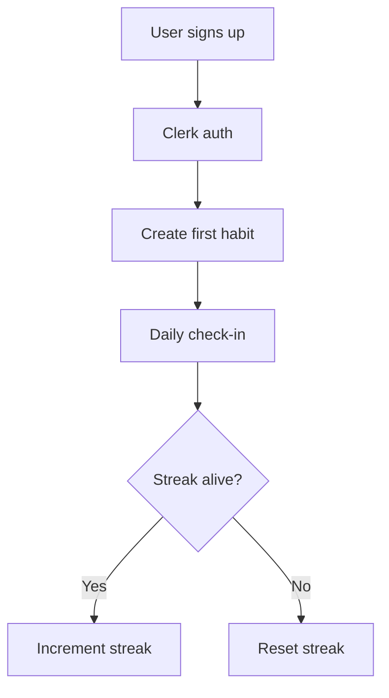

# Proposal: Dynamic, scaffold-agnostic project bootstrap for Halo

## Problem
Halo already has a spec/intake/readiness/scaffold/build pipeline, but the first-run experience is still under-specified. A fresh empty folder leaves the agent to guess the stack and ask piecemeal questions. We want a single `halo bootstrap` command that captures the user’s chosen stack, locks the brief, and then lets the existing `halo` phases generate docs, run readiness, and scaffold.

## Why the previous direction was too heavy

A large `halo-project.json` schema and a `templates/scaffold.json` registry would duplicate what `halo` already does:

- `halo specs` already generates `PRD.md`, `STACK.md`, `STORIES.md`, `MILESTONES.md`, `INTEGRATIONS.md` from `intake`.
- `halo ready` already checks CLI tools, env vars, secrets, and auth.
- `halo scaffold` already supports profiles (`nextjs-saas`, `fastapi`, `existing`) and a `Demo 0` probe.
- `docs/ARCHITECTURE.md` already states: “Stack is chosen in intake, not hardcoded by Halo.”

A better approach is to add a thin `bootstrap` orchestrator that feeds the existing `intake`/`specs`/`ready`/`scaffold` phases. The AI is the dynamic document generator; the `halo` loop is the execution engine.

## Vision

`halo bootstrap <project>` is a one-command first-run that:

1. Captures the user’s brief and stack choices (any language, framework, auth, deploy, database, style, top features).
2. Writes a concise `intake` record and locks the stack.
3. Lets `halo specs` generate the doc tree from the brief.
4. Lets `halo ready` verify CLI tools and auth/secrets.
5. Lets `halo scaffold` build the skeleton and `Demo 0`.
6. Then transitions to `build` and `halo go`.

The user can pick any stack — Next.js, Assembly, Rust, Go, Python, etc. The system is the same; only the `intake` content and the `halo scaffold` profile change.

## Research snapshot

### What AI spec generators get right

| Tool | Pattern worth borrowing |
|------|-------------------------|
| **AI Koder Spec Builder** | Interview → lock → export to coding agent |
| **Vibe Architect** | Propose → Refine → Lock; concrete options over open questions |
| **dshills/specBuilder** | Traceability from answers to spec fields |
| **AgentSpec** | Phase-gated workflow with quality gates |
| **autodev** | Research, plan, ADRs, then per-milestone TDD |
| **nspecgen** | Multi-doc output from one prompt |

### What Halo already has

| Existing piece | Role in the new bootstrap flow |
|----------------|--------------------------------|
| `halo init` | Creates `.halo/`, `state.json`, `templates/project/*` |
| `halo specs` | Generates `.halo/spec/*` from `state.intake` |
| `halo lock` | Sets `spec_status: locked` |
| `halo ready` | Reads `intake` integrations, probes CLIs/env, writes `readiness.json` |
| `halo scaffold` | Builds skeleton + `Demo 0` from `state.intake` profile |
| `halo go` | Arms the continuous loop |

The dynamic solution is to wire these together, not replace them.

## Proposed change: `halo bootstrap` as an orchestrator

### Command surface

```bash
# Interactive first run
halo bootstrap ./my-app

# One-shot from a brief
halo bootstrap ./my-app --brief "A 6502 assembler. NASM, make, CLI, no auth."

# Resume a partially completed bootstrap
halo bootstrap ./my-app --resume

# Run only intake/specs/ready/scaffold in order
halo bootstrap ./my-app --all
```

### What `halo bootstrap` does

```
halo bootstrap ./my-app --brief "..."
    │
    ├── 1. halo init ./my-app
    ├── 2. Write intake draft from brief
    ├── 3. Ask user to confirm stack and top features
    ├── 4. Lock intake → state.intake (or spec_status: locked)
    ├── 5. halo specs ./my-app
    ├── 6. halo ready ./my-app
    ├── 7. halo scaffold ./my-app --profile <auto|nextjs-saas|fastapi|existing>
    └── 8. halo go ./my-app --max 50
```

### Intake format

The existing `state.intake` already supports stack info. `halo bootstrap` just writes it more aggressively upfront:

```json
{
  "product_name": "asm-6502",
  "purpose": "A 6502 assembler and linker.",
  "audience": "retro computing hobbyists",
  "stack": {
    "language": "assembly",
    "dialect": "nasm",
    "runtime": "bare-metal",
    "framework": "none",
    "build_system": "make",
    "output_type": "cli",
    "ui": "terminal",
    "style": "unix-like, minimal, flags over config"
  },
  "services": {
    "auth": "none",
    "database": "none",
    "deploy": "none",
    "storage": "none",
    "email": "none"
  },
  "top_features": [
    "Parse 6502 mnemonics into byte output",
    "CLI: asm --in file.s --out file.bin"
  ]
}
```

`halo specs` and `halo scaffold` already read `state.intake` (see `halo_spec_write.py` and `halo_scaffold.py`). The scaffold profile can be detected from `stack` or passed explicitly.

### Dynamic doc generation

`halo specs` is already the dynamic document generator. It takes `intake` and writes a growing spec pack. The goal is to describe as much as possible up front so the build loop has no ambiguity.

#### Core spec pack (already generated by `halo_spec_write.py`)

- `PRD.md` — what we’re building, who it’s for, success metrics, in scope, out of scope, integrations, milestones summary
- `STACK.md` — chosen language, framework, build system, hosting, repo layout
- `DATA-MODEL.md` — entities, relationships, data schemas
- `DESIGN.md` — design system, screens, UX patterns
- `ARCHITECTURE.md` — boundaries, deploy topology, non-goals
- `INTEGRATIONS.md` — third-party services, credentials, required milestones
- `STORIES.md` — user stories with IDs, priority, milestone, acceptance criteria
- `MILESTONES.md` — milestones with scope, done-when, dependencies
- `READINESS.md` — placeholder overwritten by `halo ready`

#### Expanded spec pack (proposed additions)

- `API.md` — API endpoints, methods, request/response schemas, auth, rate limits, error codes, versioning, webhooks
- `USER-FLOWS.md` — flow charts / diagrams for each primary user journey (textual Mermaid or ASCII)
- `ARCHITECTURE-DECISIONS.md` (or `ADRS/`) — decision records with context, decision, consequences
- `SEQUENCE.md` — sequence diagrams for critical flows (auth, payment, data sync)
- `STATE.md` — state machines for flows with complex transitions (checkout, onboarding, jobs)
- `SECURITY.md` — threat model, authN/authZ, secrets handling, compliance, audit
- `TEST-PLAN.md` — test strategy, test cases per story, fixtures, mocking strategy, E2E flows
- `FRONTEND.md` — routes, state management, component map, form validation, error/loading states
- `BACKEND.md` — services, handlers, workers, queues, caching, rate limiting
- `MOBILE.md` — platform specifics, offline, push, store requirements (if applicable)
- `DEPLOYMENT.md` — environments, CI/CD, infra, rollbacks, feature flags
- `RUNBOOK.md` — operations, monitoring, alerts, incident response, backup/restore
- `METRICS.md` — success metrics, SLOs, analytics events, dashboards
- `PROMPTS.md` — LLM prompts, model selection, guardrails, evals (if AI features)
- `GLOSSARY.md` — domain terms, abbreviations, assumptions
- `RISKS.md` — risks, mitigations, open questions
- `PERSONAS.md` — user personas, jobs-to-be-done, pain points
- `SEED.md` — seed data, demo accounts, fixtures for local dev
- `CHANGELOG.md` — planned releases, breaking changes
- `CONTRIBUTING.md` — conventions, branch strategy, commit rules, code review

#### Data schemas and API endpoints

`halo specs` should generate concrete schemas from `intake.data_model` and `intake.api`:

```json
{
  "data_model": {
    "entities": [
      {
        "name": "User",
        "fields": [
          { "name": "id", "type": "uuid", "primary": true },
          { "name": "email", "type": "string", "unique": true },
          { "name": "created_at", "type": "datetime" }
        ]
      }
    ],
    "relationships": "User has many Habits; Habit belongs to User"
  },
  "api": {
    "endpoints": [
      { "method": "POST", "path": "/api/v1/habits", "body": "CreateHabitInput", "response": "Habit" },
      { "method": "GET", "path": "/api/v1/habits", "response": "Habit[]" }
    ]
  }
}
```

The AI can generate `DATA-MODEL.md` with entity tables, `API.md` with endpoint tables, and `USER-FLOWS.md` with Mermaid flowcharts. If the stack is not API-based, these sections become empty or marked N/A.

#### Flow charts and diagrams

Use Mermaid (text-based, version-controllable) inside `USER-FLOWS.md`, `SEQUENCE.md`, and `STATE.md`:



#### Architecture decisions

`ARCHITECTURE-DECISIONS.md` captures why the stack was chosen:

```markdown
## ADR-001: Why Next.js over Vite
- Context: SSR and auth middleware needed
- Decision: Use Next.js App Router
- Consequences: +server rendering, -complexity; requires Vercel or Node host
```

#### User stories and milestones

The existing `STORIES.md` and `MILESTONES.md` should be expanded:

- `STORIES.md` should have one story per feature with acceptance criteria, edge cases, API link, UI link, and test command.
- `MILESTONES.md` should have epics, dependencies, done-when, demo URL, and release notes.

#### What else is missing?

Possible future additions:

- `ACCESSIBILITY.md` — WCAG targets, keyboard nav, screen reader considerations
- `LOCALIZATION.md` — i18n strategy, locales, fallback
- `PERFORMANCE.md` — budgets, caching strategy, CDN, lazy loading
- `ANALYTICS.md` — events, funnels, privacy
- `AI-GOVERNANCE.md` — model usage, guardrails, evals, safety (if AI-driven)
- `COMPLIANCE.md` — GDPR, SOC2, HIPAA as needed
- `COST.md` — infra cost estimates, free-tier limits, alerts
- `SUPPORT.md` — help docs, error messages, escalation paths

The principle is: generate the docs that remove ambiguity before the first line of code. Not every project needs every doc, but the wizard should ask which apply and generate the rest.

### Scaffold selection

`halo scaffold --profile <profile>` already supports profiles:

- `auto` (detect from `package.json`, `pyproject.toml`, `intake.stack`)
- `nextjs-saas`
- `fastapi`
- `existing`

For truly custom stacks (e.g., assembly), we extend `halo_scaffold.py` with a new profile module (e.g., `python/scaffold/minimal.py`) that is chosen when `stack.language == "assembly"`. Each profile is a small Python module that writes a skeleton and returns `install_cmd` + `dev_cmd`. No `templates/scaffold.json`, no `jinja2` engine — just Python code that can be as dynamic as needed.

### Preflight / readiness

`halo ready` already probes the integrations listed in the intake. We can extend `halo_readiness.py` to:

- Check `cli.required` derived from `stack` (e.g., `make`, `nasm`, `node`, `vercel`).
- Run `auth` commands like `clerk auth login` or `vercel login` if needed.
- Write `.env.example` and refuse `GO` until `.env.local` is filled.

### Integration with existing Halo phases

- `halo bootstrap` is a phase orchestrator, not a new phase.
- It leaves `state.phase` as `build` after `halo scaffold` succeeds.
- `halo go` can then arm the continuous loop.
- `halo unlock` already returns to `spec_review`/`intake` if the user wants to change the brief.

### Edge cases

1. **Empty folder**: works as normal. `halo init` creates `.halo/`, then `halo bootstrap` writes intake and runs the pipeline.
2. **Existing project**: `halo scaffold` detects `package.json`/`pyproject.toml` and uses `existing` profile.
3. **Custom stack**: `halo bootstrap` writes the intake; if no profile matches, the agent uses `existing` and the build loop creates the first files.
4. **No CLI/auth**: `halo ready` returns `NO_GO` with a checklist. The user installs/logs in, re-runs `halo bootstrap` or `halo ready`.
5. **User changes mind**: `halo unlock` and re-run `halo bootstrap`.

## Open questions

1. Should `halo bootstrap` be a new command in `scripts/halo` or a Python script (`python/halo_bootstrap.py`) called by `scripts/halo`? A Python script is easier to test.
2. Should `halo bootstrap` support `--auto` (skip confirmation) for fully autonomous first runs? Yes, but require `auto_defaults` and `--max-questions` safety.
3. How do we add a new scaffold profile without touching `halo_scaffold.py`? Long term, `python/scaffold/*.py` can be auto-discovered; short term, add one profile at a time.
4. Should the brief be stored as a separate `PROJECT.md` or just as `state.intake`? Start with `state.intake`; later `PROJECT.md` can be a rendered human-readable view.

## Suggested first slice

1. Add `python/halo_bootstrap.py` that runs `init`, writes `state.intake` from a brief, asks confirmation, calls `halo specs`, `halo ready`, `halo scaffold`, and then `halo go`.
2. Add `halo bootstrap` command to `scripts/halo`.
3. Extend `halo_readiness.py` to derive CLI checks from `state.intake.stack`.
4. Extend `halo_scaffold.py` profile detection to support a new `minimal` profile for custom/non-web stacks.
5. Update `AGENTS.md` and `README.md` first-contact path to run `halo bootstrap` when `.halo/` is empty and `halo-project.json` is absent.

This would make the first-run experience: clone → install plugin → `halo bootstrap ./my-app --brief "..."` → `halo go`.
